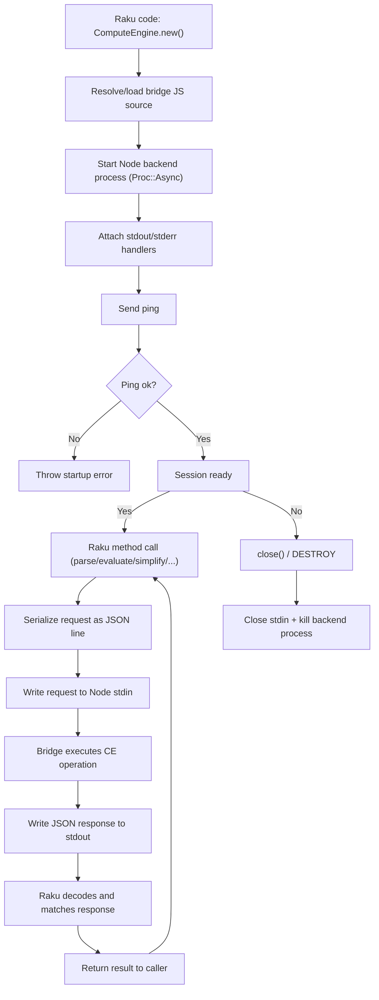

# Raku-CortexJS

[](https://github.com/antononcube/Raku-CortexJS/actions)
[](https://github.com/antononcube/Raku-CortexJS/actions)
[](https://github.com/antononcube/Raku-CortexJS/actions)

[](https://raku.land/zef:antononcube/CortexJS)
[](https://opensource.org/licenses/Artistic-2.0)


Raku client for the [MathLive Cortex-JS Compute Engine](https://mathlive.io/compute-engine/).

----

## Installation

### Preliminary setup (Node.js and Node packages)

`CortexJS` starts a Node.js backend process and requires the
`@cortex-js/compute-engine` package to be available.

macOS (Homebrew):

```bash
brew install node
npm install @cortex-js/compute-engine
```

Linux (Debian/Ubuntu):

```bash
sudo apt update
sudo apt install -y nodejs npm
npm install @cortex-js/compute-engine
```

Windows (winget, PowerShell):

```powershell
winget install OpenJS.NodeJS.LTS
npm install @cortex-js/compute-engine
```

Verify:

```bash
node --version
npm list @cortex-js/compute-engine
```

### Raku package installation

Install this Raku package, "CortexJS", from Zef ecosystem:

```
zef install CortexJS
```

From GitHub:

```
zef install https://github.com/antononcube/Raku-CortexJS.git
```

-----

## How it works?

`CortexJS::ComputeEngine` is a Raku wrapper around a long-lived Node.js backend.
When you call `ComputeEngine.new`, the wrapper:

1. Resolves or loads the bridge JavaScript (`ce-bridge.mjs`) source.
2. Starts a Node process (`node ...`) through `Proc::Async`.
3. Initializes stream handlers for `stdout` (responses) and `stderr` (diagnostics).
4. Sends an initial `ping` request to confirm the backend is ready.

During the session, each Raku method call (for example `parse-latex`, `simplify`,
`evaluate`, `expand`, `solve`) is converted into a JSON request and written to the
Node process stdin. The bridge executes the operation with
`@cortex-js/compute-engine` and writes a JSON response back to stdout.
The Raku side matches responses and returns the decoded result to your code.

When done, call `.close` (or let object destruction trigger cleanup) to stop the
backend process.



-----

## Basic usage

```raku
use CortexJS;
my $ce = ComputeEngine.new;

$ce.evaluate($ce.parse-latex('e^{i\\pi}'))
```

```raku
$ce.to-latex($ce.expand($ce.parse-latex('(a + b)^2')));
```

```raku
LEAVE $ce.close;

my $expr = $ce.parse-latex('3x^2 + 2x^2 + x + 5');
say "{$ce.to-latex($expr)} = {$ce.to-latex($ce.simplify($expr))}";
```

----

## References

[ML1] MathLive.io, [Compute Engine](https://mathlive.io/compute-engine/).
